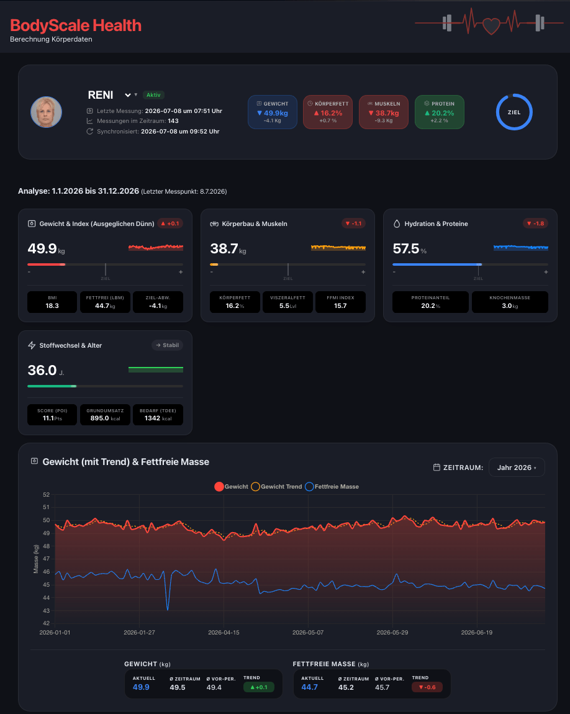

# ⚖️ home-miscale (hc_scale) v2.1.0

[](https://github.com/zibous/hc_scale/releases)
[](https://github.com/zibous/hc_scale)
[](https://python.org)
[](https://fastapi.tiangolo.com)
[](https://hub.docker.com)
[](https://mqtt.org)
[](https://www.home-assistant.io)
[](https://esphome.io)
[](https://sqlite.org)
[](https://www.chartjs.org)
[](https://jinja.palletsprojects.com)
[](#)
[](#)
[](#)
[](#)
[](https://www.buymeacoff.ee/zibous)

Körperwaage Dashboard für Xiaomi Mi Body Composition Scale 2.
ESP32 (ESPHome) sendet Waage-Daten per HTTP POST → FastAPI berechnet Body Metrics → SQLite + MQTT → Home Assistant.



## Features

- ⚖️ **Xiaomi Mi Body Composition Scale 2** – BLE via ESP32
- 🧮 **Body Metrics** – BMI, Körperfett, Muskelmasse, Wasser, Protein, Viszeralfett, Knochenmasse
- 🏆 **Body Score** – Reverse-engineered aus Mi Fit App (0–100 Punkte)
- 🏋️ **Athleten-Modus** – Korrekturfaktoren via lineare Regression
- 📊 **Dashboard** – Chart.js Verlaufskurven mit Dark/Light Theme
- 👥 **Multi-User** – Automatische Erkennung über Name oder Gewichts-Match
- 📡 **MQTT + HA Discovery** – Sensoren automatisch in Home Assistant
- 🔔 **Webhooks** – Heartbeat + Messwert-Events an HA
- 💾 **SQLite + CSV-History** – Tagesmessungen + monatliche CSV-Exporte
- 🛡️ **Debounce** – 30s Sperre gegen Doppelmessungen
- 📈 **KPI-Endpoint** – für zentrales Übersichts-Dashboard
- 🐳 **Docker-ready** – Graceful Shutdown, Volume-Mounts

## Application Workflow

```
┌─────────────────────────────────────────────────────────────────────────┐
│                        Xiaomi Mi Scale 2 (BLE)                          │
│                        MAC: 5C:CA:D3:4C:EE:74                           │
└───────────────────────────────┬─────────────────────────────────────────┘
                                │ BLE Advertisement (weight + impedance)
                                ▼
┌─────────────────────────────────────────────────────────────────────────┐
│                        ESP32 (ESPHome)                                  │
│  • BLE Scan → Gewicht + Impedanz empfangen                              │
│  • User-Erkennung (Gewichts-Schwellwert)                                │
│  • HTTP POST an FastAPI                                                 │
└───────────────────────────────┬─────────────────────────────────────────┘
                                │ POST /miscale
                                ▼
┌─────────────────────────────────────────────────────────────────────────┐
│                        FastAPI (Port 5056)                              │
│                                                                         │
│  ┌──────────────┐     ┌──────────────────┐     ┌──────────────────────┐ │
│  │ Debounce     │────>│ CalcData Service │────>│ Body Score           │ │
│  │ (30s Sperre) │     │ • BMI            │     │ (Mi Fit reverse-eng) │ │
│  └──────────────┘     │ • Körperfett     │     │ • 8 Teilscores       │ │
│                       │ • Muskelmasse    │     │ • Gesamt 0-100       │ │
│                       │ • Wasser         │     └──────────────────────┘ │
│                       │ • Protein        │                              │
│                       │ • Viszeralfett   │                              │
│                       │ • Knochenmasse   │                              │
│                       │ • BMR / TDEE     │                              │
│                       │ • Metabol. Alter │                              │
│                       └────────┬─────────┘                              │
│                                │                                        │
│              ┌─────────────────┼──────────────────┐                     │
│              │                 │                  │                     │
│              ▼                 ▼                  ▼                     │
│  ┌──────────────────┐  ┌──────────────┐  ┌────────────────┐             │
│  │ SQLite DB        │  │ MQTT Broker  │  │ HA Webhook     │             │
│  │ miscaledata.db   │  │ bodyscale/   │  │ (Event)        │             │
│  │ + CSV History    │  │ data/{user}  │  │                │             │
│  └──────────────────┘  └──────────────┘  └────────────────┘             │
│              │                  │                                       │
│              ▼                  ▼                                       │
│  ┌──────────────────┐  ┌──────────────────────┐                         │
│  │ Dashboard API    │  │ Home Assistant       │                         │
│  │ /dashboard/api/  │  │ • MQTT Discovery     │                         │
│  │ datav2, users,   │  │ • Sensoren pro User  │                         │
│  │ export (CSV)     │  │ • Automationen       │                         │
│  └──────────────────┘  └──────────────────────┘                         │
└─────────────────────────────────────────────────────────────────────────┘
```

## Quick Start

```bash
# Virtuelle Umgebung aktivieren
source ../.venv/bin/activate

# Dependencies installieren
make install

# Entwicklungsserver starten (Port 4056, auto-reload)
make dev

# Testmessung absenden
make test-post
```

## API Endpoints

| Endpoint | Methode | Beschreibung |
|----------|---------|-------------|
| `/` | GET | Dashboard (HTML) |
| `/{name}` | GET | HTML-Seite aus frontend/ |
| `/api/health` | GET | Health Check |
| `/api/appstatus` | GET | App-Status (MQTT, DB, Users) |
| `/api/kpi` | GET | KPI-Daten für Übersichtsdashboard |
| `/miscale` | POST | ESP32 Waage-Daten empfangen |
| `/dashboard/api/data` | GET | Messdaten (v1) |
| `/dashboard/api/datav2` | GET | Messdaten + User-Dropdown (v2) |
| `/dashboard/api/users` | GET | Verfügbare User mit Stats |
| `/dashboard/api/export` | GET | CSV Export |
| `/dashboard/avatar/{name}` | GET | Avatar-Bild |

## ESP32 POST Format

```json
{
  "name": "Peter",
  "weight": 69.5,
  "impedance": 580,
  "timestamp": "2026-06-05T16:05:07"
}
```

Antwort bei Erfolg:
```json
{"status": "ok", "user": "Peter", "weight": 69.5}
```

## Warum die BIA-Messung bei Sportlern

Die bioelektrische Impedanzanalyse (BIA) basiert standardmäßig auf mathematischen Formeln,
die für den durchschnittlichen, eher untrainierten Körper entwickelt wurden.

Bei Sportlern führt das zu systematischen Messfehlern:

* **Der Muskel-Irrtum:** Das Muskelgewebe von Athleten hat eine höhere Dichte, einen veränderten Wasseranteil (Hydratation) und eine stärkere Durchblutung als bei Untrainierten.
* **Die Fehlmessung:** Die Standard-Formel interpretiert den veränderten elektrischen Widerstand (Impedanz) des sportlichen Muskels falsch und ordnet ihn fälschlicherweise als Fettgewebe ein.
* **Das Ergebnis:** Ohne Korrektur zeigt die Waage bei Athleten systematisch einen **zu hohen Fettanteil** und eine **zu geringe Muskelmasse** an.

## Was bewirkt der „Athletic-Modus“ (`athletic: true`)?

Sobald dieser Modus aktiviert ist, schaltet die Software auf spezielle Schätzformeln um,
die über **lineare Regressionsfaktoren** an echten Sportlern validiert wurden:

* Die Faktoren passen die Berechnung an das spezifische Verhältnis von Gesamtkörperwasser und Muskelzellmasse trainierter Menschen aus.
* Der Algorithmus korrigiert den Rechenfehler, senkt den angezeigten Fettanteil und hebt die Muskelmasse auf ein realistisches Niveau an.

Im Code lässt sich diese Anpassung über dynamische, lineare Korrekturfaktoren lösen. Das folgende Python-Snippet zeigt, wie die Rohdaten der Waage basierend auf dem Körpergewicht des Nutzers angepasst werden, sobald `athletic: true` aktiv ist:

```python
def _apply_adjustments(self):
    # Wenn der Athletic-Modus deaktiviert ist, wird nichts verändert
    if not self.user.athletic:
        return

    w = self.weight
    d = self.data

    # Lineare Regressionsfaktoren basierend auf dem Gewicht
    factors = {
        "fat": 0.018411 * w + (-0.6888),
        "water": 0.000908 * w + 0.9799,
        "bone": -0.001150 * w + 1.3863,
        "muscle": -0.016164 * w + 2.1373,
    }

    # Werte korrigieren und auf zwei Nachkommastellen runden
    for field, factor in factors.items():
        if field in d:
            d[field] = round(d[field] * factor, 2)
```

### Wie die Formel arbeitet:
* **Fettanteil (`fat`)**: Der Faktor korrigiert die systematische Überschätzung der Waage bei trainierten Menschen nach unten.
* **Muskelmasse (`muscle`)**: Der Basis-Faktor startet hoch und fängt die messtechnische Unterschätzung bei geringem Körperfettanteil effektiv auf.
* **Wasseranteil (`water`)**: Da Muskelgewebe stark hydriert ist, wird der Wasserwert minimal angehoben.


## Projektstruktur

```
hc_scale/
├── app/
│   ├── main.py                    # FastAPI Entry Point (Orchestrierung)
│   ├── core/
│   │   ├── config.py              # Zentrale Config (Pfadauflösung, .env)
│   │   ├── logging.py             # Logger (Console + File)
│   │   ├── mqtt.py                # MQTT Client mit Retry
│   │   ├── mqtt_startup.py        # HA Discovery + Publish bei Start
│   │   ├── webhook.py             # HA Webhook
│   │   ├── shutdown.py            # Graceful Shutdown
│   │   └── heartbeat.py           # Periodischer MQTT Heartbeat
│   ├── api/
│   │   ├── middleware.py          # No-Cache Headers
│   │   └── routes/
│   │       ├── health.py          # /api/health
│   │       ├── appstatus.py       # /api/appstatus
│   │       ├── kpi.py             # /api/kpi
│   │       ├── miscale.py         # POST /miscale (Debounce)
│   │       ├── dashboard.py       # Dashboard API (Daten, Export, Avatar)
│   │       └── pages.py           # HTML-Seiten Rendering
│   ├── models/
│   │   ├── person.py              # UserProfile Dataclass
│   │   └── user_service.py        # User-Lookup aus persons.yaml
│   ├── schemas/
│   │   └── kpi.py                 # KPI Response Schema
│   └── services/
│       ├── body_metrics.py        # Body Metrics (Xiaomi-Formeln)
│       ├── body_scales.py         # Referenzskalen (Alter/Geschlecht)
│       ├── body_score.py          # Body Score Berechnung
│       ├── calcdata.py            # Hauptberechnung + Score-Aggregation
│       ├── db_manager.py          # SQLite + CSV-History
│       ├── ha_discovery.py        # HA MQTT Auto-Discovery
│       └── kpi_service.py         # KPI-Daten für Übersicht
├── config/
│   ├── persons.yaml               # User-Profile (Gewicht, Größe, Ziele)
│   ├── ha_discovery.yaml          # HA Sensor-Definitionen
│   └── lang/de.yaml               # Sprachdaten
├── data/                          # DB + JSON-Referenzdaten + History
├── frontend/
│   ├── index.html                 # Dashboard UI
│   └── static/                    # CSS, JS (esbuild Bundles)
├── logs/                          # Log-Dateien (bei LOG_MODE=file)
├── scripts/                       # Hilfsskripte
├── .env                           # Konfiguration (nicht im Git)
├── .env.example                   # Vorlage
├── Dockerfile
├── docker-compose.yml
├── Makefile
├── pyproject.toml
└── requirements.txt
```

## Konfiguration (.env)

```env
APP_NAME=home-miscale
APP_VERSION=2.1.0
PORT=5056

# MQTT
MQTT_HOST=10.1.1.119
MQTT_PORT=1883
MQTT_TOPIC=bodyscale/data

# Datenbank & Dateien (relativ = zu PROJECT_ROOT, absolut = wie angegeben)
DB_PATH=data/miscaledata.db
DATA_DIR=data

# Logging (mode: console = nur Terminal, file = Terminal + Datei)
LOG_LEVEL=INFO
LOG_MODE=file
LOG_FILE=logs/miscale.log

# Home Assistant
HA_WEBHOOK_URL=http://10.1.1.217:8123
HA_WEBHOOK_ID=miscale
```

Pfade in `.env` können relativ oder absolut sein:
- **Relativ** (`data/miscaledata.db`) → wird gegen Projekt-Root aufgelöst
- **Absolut** (`/app/data/miscaledata.db`) → wird direkt verwendet

## Makefile Targets

### Entwicklung
| Target | Beschreibung |
|--------|-------------|
| `make dev` | Lokaler Server mit auto-reload (Port 4056) |
| `make run` | Lokaler Server ohne reload (Port 4056) |
| `make install` | pip install -r requirements.txt |

### Docker
| Target | Beschreibung |
|--------|-------------|
| `make build` | Docker Image bauen |
| `make up` | Container starten (Port 5000 → 5056) |
| `make down` | Container stoppen |
| `make rebuild` | Rebuild ohne Cache + Neustart |
| `make logs` | Docker Logs (follow) |
| `make shell` | Shell im Container |

### Test
| Target | Beschreibung |
|--------|-------------|
| `make test-post` | POST Testmessung (Reni) |
| `make test-post-peter` | POST Testmessung (Peter) |
| `make test-health` | Health-Check |

### Wartung
| Target | Beschreibung |
|--------|-------------|
| `make compare` | Lokale Dateien vs. Container vergleichen |
| `make diff-detail` | Inhaltliche Diffs zum Container |
| `make backup` | DB Backup mit Datum |
| `make git-update` | Git commit + push zu Forgejo |
| `make jsbuild` | JS/CSS Bundle (esbuild via Docker) |
| `make jsclean` | Bundle-Dateien entfernen |

## Docker

```bash
make build    # Image bauen
make up       # Container starten
make logs     # Logs folgen
```

Volumes (gemountet, nicht im Image):
- `data/` → `/app/data` (DB, JSONs, History)
- `config/` → `/app/config` (persons.yaml, lang/)
- `frontend/` → `/app/frontend` (HTML, CSS, JS)
- `logs/` → `/app/logs` (Log-Dateien)

## Nginx Reverse Proxy

```nginx
location /dashboardmiscale/ {
    proxy_pass http://10.1.1.119:5000/;
    proxy_set_header Host $host;
    proxy_set_header X-Real-IP $remote_addr;
    proxy_set_header X-Forwarded-For $proxy_add_x_forwarded_for;
    proxy_set_header X-Forwarded-Proto $scheme;
    proxy_set_header X-Forwarded-Prefix /dashboardmiscale;
}
```

## Git (Forgejo)

```bash
make git-update   # Commit + Push in einem Schritt
```

Repository: http://10.1.1.119:3043/peter/hc_scale.git
